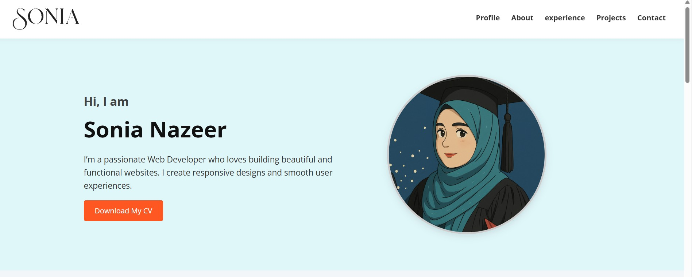
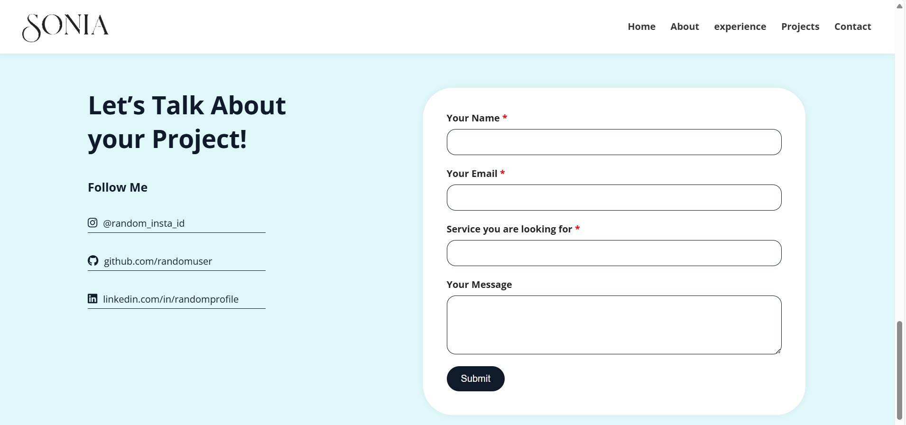

# 💼 Sonia Nazeer - Portfolio Website

This is a **simple personal portfolio website** made using only **HTML** and **CSS**. It highlights my skills, experience, and projects as a Web Developer.

---

## 📁 Sections in the Website

1. **Home Section**
   - Introduction with name and profession
   - Profile picture
   - CV download button

2. **About Me**
   - Short bio
   - Skills list (Frontend, Backend, GitHub, Responsive design etc.)

3. **Experience**
   - Table showing past work 

4. **Projects**
   - Portfolio Website (this one!)
   - Project preview with video demo

5. **Contact**
   - Contact form for users to send a message
   - Social media links (Instagram, GitHub, LinkedIn)

---

## 🛠️ Technologies Used

- HTML5
- CSS3
- Google Fonts (for custom font)

---

## 📷 Preview

---

## 📄 How to Run the Website

1. Clone or download the project
2. Open the `index.html` file in any browser
3. All images/videos/CV should be in the correct folders like `/images`, `/media`

---

## 📬 Contact

You can reach me via:

- GitHub: https://github.com/sonia-nazeer
- LinkedIn:https://www.linkedin.com/in/sonia-nazeer-aba72b280/
---

> 🌟 This is a beginner-level portfolio project. Designed with love ❤️ by Sonia Nazeer.
